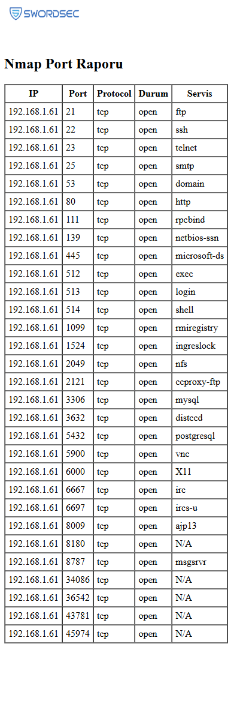

# Nmap Çıktısı –> Nmap XML  → HTML Raporu   - Eren Abdullah BEŞİK

Bu proje, Nmap ile alınan port tarama sonuçlarını XML formatından HTML raporuna dönüştüren bir Python scriptidir. 
HTML raporunda IP, port, protokol, durum ve servis bilgileri tablo olarak gözükür.

##  Adım Adım Kullanım

### 1. Nmap ile Tarama Yap
Aşağıdaki komutu çalıştırarak tüm portları XML formatında tara:

nmap -p- -T4 -oX scan.xml <hedef_ip>

## Böylece nmap çıktısı bulunan klasöre kaydedilir.

### 2. Python Scripti çalıştır.

python3 xml_parseTo_html.py

### 3. Oluşan .html dosyasını tarayıcıda aç. 

├── `xml_parseTo_html.py     # XML'den HTML raporu oluşturan Python script`  \
├── `scan.xml                 # Nmap çıktısı (tarama sonucu)`  \
├── `htmlrapor.html           # Oluşan HTML rapor (çıktı)`  \
├── `logo.png                 # Raporun başında gösterilecek logo`  \
└── `README.md                # Bu dosya`  

HTML Rapor SS:

